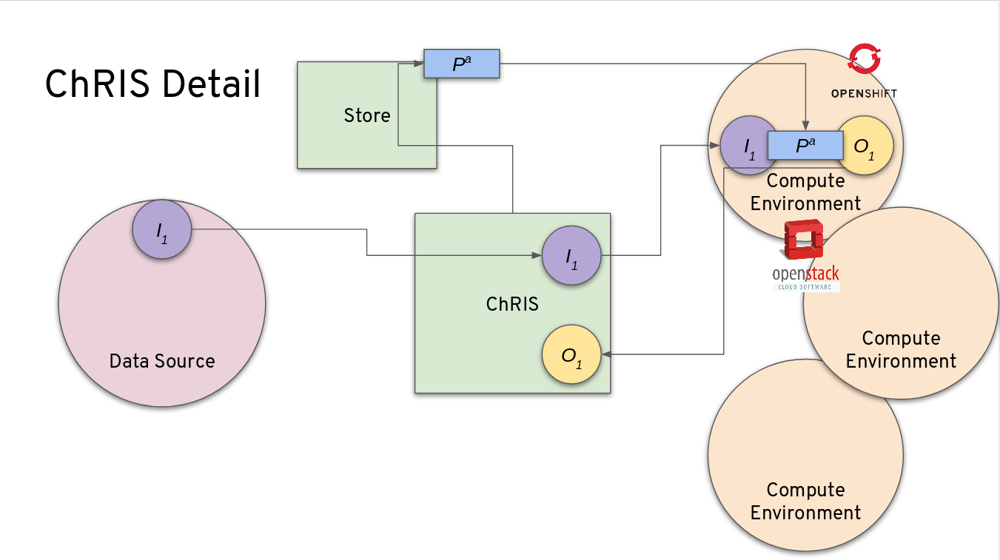

= ChRIS

== Abstract

This page presents a quick overview of ChRIS, followed by some links to more resources, papers, and talks.

image::/images/mpc/PACSPull_Output.png[PACS Pull Output]

== Overview

ChRIS (**Ch**RIS **R**esearch **I**ntegration **S**ervice) is an opensource distributed software platform designed to manage and coordinate computation and data on a multitude of computing environments.
Originally developed for medical image analysis in the Fetal-Neonatal Neuroimaging and Developmental Science Center at Boston Children's Hospital, ChRIS has evolved into a general-purpose compute/data platform making it easy to deploy analysis on a heterogenous mix of compute environments -- from laptops to loosely connected groups of workstations, to high performance compute clusters, to public clouds.

ChRIS is designed to manage the execution and data needs of a specific class of computational applications often used in research (and in particular medical image research) settings.
*These are applications that require no user interaction once started*, have runtime specifications typically passed in command line arguments, and collect all output in files.

While ChRIS itself has a web-based user interface, the applications that perform the computations are containerized, Linux-based applications.
Since these apps run "in the woodwork" so to speak, they are called _plugins_ in ChRIS parlance, since they plug-into the ChRIS backend and are accessible from a suitable frontend.

ChRIS comprises a collection of REST-based web services, backend web apps, and various client-facing web front ends.
The system is designed to make it as _easy_ as possible for a developer to get his/her app running _anywhere_ (by which is meant _any computing environment_ that can run linux containers).
By conforming to a reasonable command-line specification or contract for ChRIS applications, ChRIS makes it easy to containerize and run the research software, collect results, visualize data, and share/collaborate.

== Need

Computational research in scientific (as opposed to industry) medical-related fields faces many obstacles, including (but not limited to):

=== data sharing

Within the ChRIS framework, data is managed and shared using services such as `Swift/Ceph` between various users of the system.

=== data protection

Data is protected on various levels by utilizing the isolation technologies of OpenShift including network isolation, container isolation utilizing namespaces and SELinux, and role level isolation that keep image plugins from escaping outside their linux container.

=== data visualization

Powerful javascript libraries are available for viewing and interacting with medical image data formats.

=== algorithm/program sharing

ChRIS is built on the idea of using containerized components that perform the actual analysis and processing.
This standardizes application development and deployment for reuse.

=== re-use of existing programs in different environment

The pervasive use of container images allows for the easy re-use of analysis in many environments.
The same container image that is run on a local laptop can be deployed out to a cloud resource.

=== access to powerful hardware

ChRIS is currently deployed to the Mass Open Cloud (MOC) and provides access to powerful resources including high-end GPUs.

=== realtime collaboration

The front end to ChRIS provides a powerful real time collaboration tool.

== Deeper dive into how ChRIS works

To run medical image processing on ChRIS, a medical researcher/programmer encodes the algorithm that needs to be executed in the form of "plugin".
The researcher/programmer then makes the plugin available via the ChRIS store.
An administration of a ChRIS installation then makes the plugin available through their ChRIS installation.
Once registered, users of the ChRIS system can use a plugin within their image analysis pipeline.
Once execution of a plugin starts, pfcon, running at BCH datacenter, sends the data via pfioh and the algorithm to be applied on the data to pman.
Pman and pfioh can run in a different datacenter (Ex: The MOC running OpenShift on top of OpenStack).
Pman then translates the algorithm programmed in the plugin as Kubernetes job.
To add scale to medical image processing, pman divides the job amongst several Kubernetes job pods that run in parallel.
OpenShift provides the container platform for seamless orchestration and resource management on the cluster.

image::chris_architecture_detailed.png[Chris Architecture]

== Example: Multi-Party Computation with ChRIS

To understand ChRIS better, an example might help.
You can learn more about this example from https://youtu.be/FUu4kMc0PL8?t=3802[Dr.
Ellen Grant's talk at Red Hat Summit 2019]

image::/images/mpc/Feed-Detail-Screencapture-PACS-selected.png[PACSPull Plugin]

The above tree illustrates how a typical workflow looks in ChRIS.
The nodes are various plugins that will be executed in ChRIS in the order of their hierarchy.
The first node is for "`PACS Pull`" plugin.
It pulls the MRI scan data for the workflow from BCH database into the computing environment, the MOC in this case.
The output of this plugin is the input to the whole operation represented in the tree structure, a patient's brain MRI.

image::/images/mpc/PACSPull_Output.png[PACS Pull Output]

Next in chain is "`FreeSurfer`" plugin.
It performs volume and surface based analysis of the MRI data and facilitates the visualization of the functional regions of the highly folded cerebral cortex.

image:/images/mpc/Freesurfer-2D-image.png[Free Surfer Plugin 2D Output] This is the 2D image output of FreeSurfer plugin.
The colored regions depict various segments in the gray matter of the brain.

image:/images/mpc/Freesurfer-3D-Screencpature.png[Free Surfer Plugin 3D Output] This is the 3D image output of FreeSurfer plugin.
The colored regions depict various segments in the gray matter of the brain.

image::/images/mpc/Freesurfer-data-table.png[Free Surfer Plugin Data table]

FreeSurfer plugin also gives output in the format of a datatable.
The first column consists of various segments in the cerebral cortex.
The following columns gives Surface Area, Volume and Thickness of left and right hemispheres of the brain.

So what is MPC and how does it fit in "`Brain Analysis`"?
Multiparty Computation (MPC) allows computation on encrypted values without sharing data entirely.
Understanding rare diseases might require several hospitals to contribute their data toward image processing, and sharing patient data in the clear is restricted by privacy laws and hospital standard practices.
Augmenting ChRIS with cryptographically secure multi-party computation allows multiple hospitals to jointly analyze data that they cannot observe individually.
As a consequence, each hospital need not entrust other hospitals or the cloud vendor with its patient data.
This MPC plugin compares a patient's brain volume with the population data collected from two different hospitals.
To achieve this ChRIS interacts with another open source project https://github.com/cici-conclave/conclave-web[Conclave Cloud Dataverse or C2D].
C2D uses OpenShift to provide isolated computing environment for MPC job pods.

image::/images/mpc/Volumet-screencapture-grids.png[MPC output]

The above graph extrapolates the patient's data (who is 10 years old) against the population mean for the segment "`G_and_S_frontomargin`" for various age groups.
The blue line is for left hemisphere and the orange line is for right hemisphere.
We can infer from the graph that the patient's brain volume for both hemispheres is lower than the population mean volume for 10 years olds.

image::/images/mpc/Segment-screencapture-grids.png[MPC output]

It is also interesting to know which segments have significant deviation from the population mean in terms of brain volume for the same age group.
From this graph one can find that for this patient there are 4 segments which have conspicuous deviation when compared to other 10 year olds.

image::/images/mpc/zscore-screen_capture.png[MPC output]

This view represents the raw data that made up the previous bar chart.
It allows the radiologist/researcher to easily see how every brain segment compares to the population mean with helpful color coding for the largest deviations.

The last plugin "`z2LabelMap`" takes the zscore, output of MPC plugin, and creates a heat map by projecting the zscore as highlighted areas in the actual brain image.

image::/images/mpc/z-score-2D-image-with-legend.png[MPC output]

This image shows segments with the most conspicuous deviation from population mean.
Blue regions depicts negative deviation and red ones positive deviation.

== History

ChRIS has had several historical epochs:

=== `bash` shell scripts

The earliest versions of what would coalesce into ChRIS were collections of `bash` shell scripts that coordinated various types of analysis programs.
This was prior to 2009/2010.

=== ChRIS v1

The first version of what would become ChRIS was created in 2010 and was built using *Wt* (web toolkit) from Emweb.
It was geared to replacing the interface to the previous `bash` scripted system and interfaced with an in-house HPC for analysis.

=== ChRIS v2

The second version of ChRIS, released around 2013, replaced *Wt* with a cleaner, twitter-inspired interface built around the concept of _feeds_ and _plugins_.
This version of ChRIS interfaced primarily with HPC clusters.
It is still in production use today.

=== ChRIS v3

The current development version of ChRIS features a complete redesign and shift to using REST-based services for distributed computing, and dockerized containers for data processing.
In some contexts, this version of ChRIS is also called _CHIPS_.

== Recent Papers

Some papers and conference proceedings on ChRIS -- please note in some papers the system is called _CHIPS_ as the internal name for ChRIS v3:

* Rudolph Pienaar, Ata Turk, Jorge L.
Bernal-Rusiel, Nicolas Rannou, Daniel.
Haehn, Steve Pieper, Patricia E.
Grant, and Orran Krieger.
"`https://github.com/FNNDSC/CHRIS_docs/blob/master/papers/LNCS_VLDB_Healthcare.pdf[CHIPS -- A Service for Collecting, Organizing, Processing, and Sharing Medical Image Data in the Cloud.]`" In: Lecture Notes in Computer Science, Vol.
10494, pp.
29--35, 2017.
* Rudolph Pienaar, Jorge L.
Bernal-Rusiel, Nicolas Rannou, Daniel Haehn, Patricia E.
Grant, Ata Turk, and Orran Krieger.
"`https://github.com/FNNDSC/CHRIS_docs/blob/master/papers/FTC_2017_IEEE_Conference.pdf[Architecting and Building the Future of Healthcare Informatics: Cloud, Containers, Big Data and CHIPS.]`" In: IEEE Future Technologies, 2017.
* Bernal-Rusiel, Jorge L., Nicolas Rannou, Randy L.
Gollub, Steve Pieper, Shawn Murphy, Richard Robertson, Patricia E.
Grant, and Rudolph Pienaar.
"`https://github.com/FNNDSC/CHRIS_docs/blob/master/papers/fninf-11-00032.pdf[Reusable Client-Side JavaScript Modules for Immersive Web-Based Real-Time Collaborative Neuroimage Visualization.]`" In: Frontiers in neuroinformatics 11, p.
32, 2017.
* R Pienaar, N Rannou, J Bernal-Rusiel, D Haehn, and P E Grant.
"`https://github.com/FNNDSC/CHRIS_docs/blob/master/papers/EMBS_ChRIS_IEEE_Conference.pdf[ChRIS -- A Web-Based NeuroImaging and Informatics System for Collecting, Organizing, Processing, Visualizing, and Sharing of Medical Data]`".
In: IEEE Engineering in Medicine and Biology Magazine.
* Nicolas Rannou, Jorge Luis Bernal-Rusiel, Daniel Haehn, Patricia Ellen Grant, Rudolph Pienaar, "https://github.com/FNNDSC/CHRIS_docs/blob/master/papers/esmrmb2017.7403b23.NORMAL.pdf[Medical imaging in the browser with the A* Medical Imaging (AMI) toolkit.]", European Society for Magnetic Resonance in Medicine and Biology 2017.

== Recent Talks

Some recent talks on ChRIS (please note there is much recycling on content below!
I've added a quick note to the time length as a partial guide):

https://youtu.be/FUu4kMc0PL8?t=3802[Red Hat Summit, "`ChRIS and Multi-Party Compute`" May 2019 (11 minutes)]

https://www.youtube.com/watch?v=p1Y9wlPSgt4[Red Hat Summit, "Medical Image Processing with OpenShift and OpenStack" May 2018 (50 minutes)]

http://slides.com/debio/deck-6-7-8-12-13-19-22[National Alliance for Medical Computing, NA-MIC, Jan 2018 Project week talk (30 minutues)]

http://slides.com/debio/deck-6-7-8-12-13-19[Massachusetts Open Cloud (5 minutes)]

== Programming Links

Links to ChRIS components:

Main ChRIS engine:

* https://github.com/FNNDSC/ChRIS_ultron_backEnd[ChRIS Ultron BackEnd (CUBE)]

Ancillary ChRIS services:

* https://github.com/FNNDSC/pfcon[process-and-file controller (pfcon)]: Main coordinating service.
* https://github.com/FNNDSC/pfioh[process-and-file IO handler (pfioh)]: Transfer data to and from different compute environments.
* https://github.com/FNNDSC/pman[process manager (pman)]: Handles processes on compute environments.
* https://github.com/FNNDSC/pfurl[process-and-file url (pfurl)]: A curl-based client tailored for use in the system.

ChRIS plugin app store

* https://github.com/FNNDSC/ChRIS_store[ChRIS_store]

ChRIS Frontend

* https://github.com/FNNDSC/ChRIS_ui[ChRIS Frontend]
