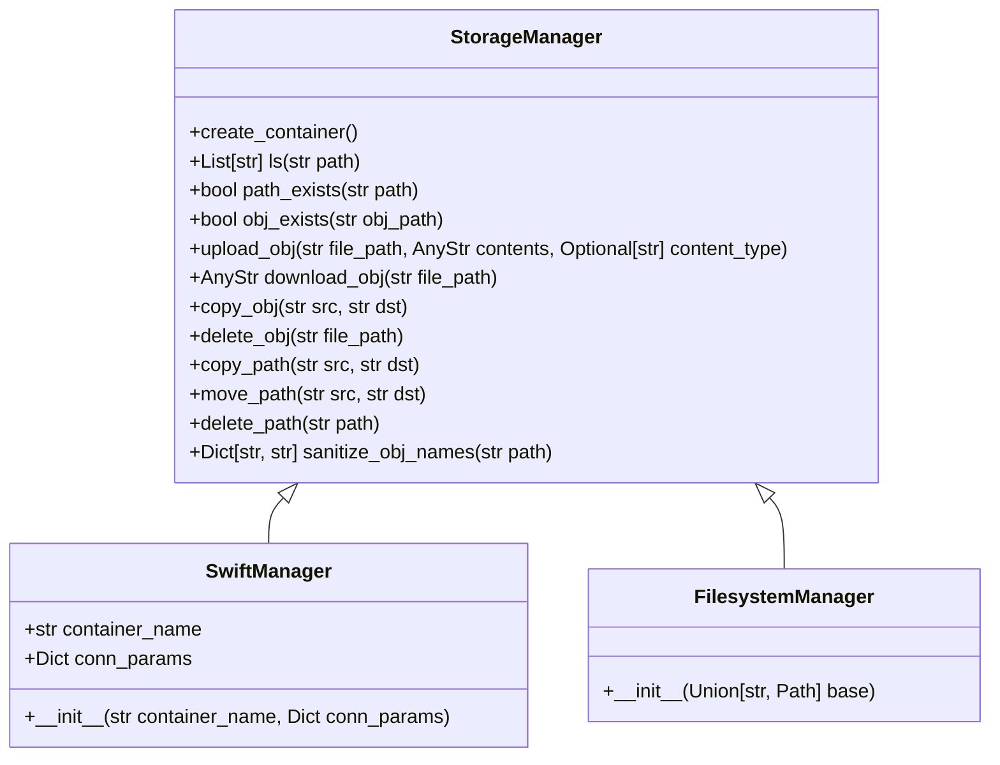

# Technical documentation about the ChRIS filesystem

## Abstract

This page provides a technical overview about the ChRIS's filesystem and storage.

## Introduction 

The ChRIS platform is implemented as a three-layer system with the following layers bottom up:
1. [Raw storage layer](#raw-storage-layer)
2. [ChRIS filesystem layer](#chris-filesystem-layer)
3. Application layer

The raw storage layer can use any object storage (eg. OpenStack Swift or Ceph, AWS S3, etc...) or POSIX filesystem (eg. Linux filesystem) based implementation. This layer implements the raw storage of files and provides the next layer with a unified application programming interface (API).

The ChRIS filesystem layer uses the API from the previous layer to create an abstraction of filesystem objects such as folders, files and link files necessary to satisfy the data organization and collaboration requirements of the ChRIS platform. These objects are made available to the next layer.

The application layer implements most of the functionality and concepts provided by the ChRIS platform (feeds, plugins, pipelines, workflows, etc...) on top of the ChRIS filesystem layer. 

This technical documents focuses on the first two layers.

## Raw storage layer

This layer is abstracted to the ChRIS filesystem layer by the following extensible Python class hierarchy:

In this hierarchy `StorageManager` is the abstract base class defining the unified interface to the ChRIS filesystem layer. The `SwiftManager` and `FilesystemManager` are the concrete classes implementing the API for Swift object storage and Linux filesystem respectively. 

## ChRIS filesystem layer
This layer exposes the following filesystem objects to the application layer:
1. [ChRIS folder](#chris-folder)
2. [ChRIS file](#chris-file)
3. [ChRIS link file](#chris-link-file)

These are modeled after the traditional POSIX filesystems' folders, files and soft links and are implemented using Django model classes. All of the objects have a user owner that has full read-write access to the object. The owner can in turn grant read (`'r'`) or write (`'w'`) access permission to the object to any other existing user or group in ChRIS. The owner can also make the object `public` which means every user including non-authenticated users have read access to the object. 

In addition all of the objects have a unique associated path (`path` attribute in folders and `fname` attribute in files and link files) but unlike POSIX filesystems no path in ChRIS filesystem can start or end with a forward slash. These "relative" paths facilitate working with object storage systems and zip files and abstract the user from absolute paths if the raw storage system is a POSIX filesystem. Also by not allowing any trailing slash the uniqueness of a path representation can be guaranteed.

### ChRIS folder

ChRIS folders are implemented by the core `ChrisFolder` Django model class and their unique paths are given by their `path` attribute. Similar to a POSIX filesystem the ChRIS filesystem is organized in a tree hierarchy of folders with he root folder representing the empty path (`''`). The following top level folders are available as descendants of the root folder:
|folder path|purpose|owner|default permissions|
|------|-------|-----|------------------|
|SERVICES|Store files from internal services|chris|`'r'` for the `all_users` group|
|SERVICES/PACS|Store files from PACS|chris|`'r'` for the `pacs_users` group|
|PIPELINES|Store uploaded pipeline files|chris|`public`|
|PUBLIC|Store public link files pointing to public objects|chris|`public`|
|SHARED|Store shared link files pointing to shared objects|chris|`'r'` for the `all_users` group|
|home|Store users' home dirs|chris|`'r'` for the `all_users` group|

### ChRIS file

ChRIS files are implemented by Django model classes that inherit from the core `ChrisFile` Django model class and represent files in the ChRIS filesystem. A ChRIS file always has a parent folder and its unique path is given by its `fname` attribute. Each ChRIS file object has a corresponding file with its contents stored in raw storage.

There are currently three types of files:
1. **PACS files** implemented by the `PACSFile` Django model class and representing files fetched by the ChRIS system from a hospital's PACS.
2. **Pipeline source files** implemented by the `PipelineSourceFile` Django model class and representing `yaml` or `json` files containing definitions of ChRIS pipelines and that have been uploaded by users to the ChRIS system.
2. **User files** implemented by the `UserFile` Django model class and representing files that have been uploaded by users to the ChRIS system. This type of files can also be generated by analyses (pipeline or plugin runs) conducted by those users.

### ChRIS link file

ChRIS link files are implemented by the core `ChrisLinkFile` Django model class and represent soft links (special types of files) in the ChRIS filesystem. A ChRIS link file always has a parent folder and its unique path is given by its `fname` attribute. In addition this object has a `path` attribute which points to the unique path of another object in the ChRIS filesystem. Each ChRIS link file object has a corresponding text file with the `.chrislink` extension with its contents (just the path to another object) stored in raw storage. 

### Sharing files or folders in ChRIS
Any ChRIS filesystem object can be publicly shared by its owner. Which grants read permission to the object to any authenticated or unauthenticated user of the system. It can also be shared with read or wite permission by the owner with specific users or groups. In particular when a folder is shared all the objects under the filesystem tree that has that folder as root are recursively shared with the same permissions. This is similar to the `chmod -R + ['r'|'w']` command in Unix. Note that this does not follow links.

The fact that sharing a folder does not follow links has important implications for the upper application layer. For instance in order to minimize storage space consumption the ChRIS system automatically creates ChRIS (soft) links to any source data folder already in storage when a user creates a feed (analysis) from that folder. This avoids repeatedly copying the same data to the user's feed space (within `home/<user>/feeds`). If the user then shares the created feed with another user the feed's folder is also shared with the other user. However the other user won't be able to access the original data folder yet if it is private under the sharing user's home folder. This is because only the ChRIS link created within the feed folder is shared rather than the original folder. The sharing user will have to explicitly give access to the original data folder to the other user.
