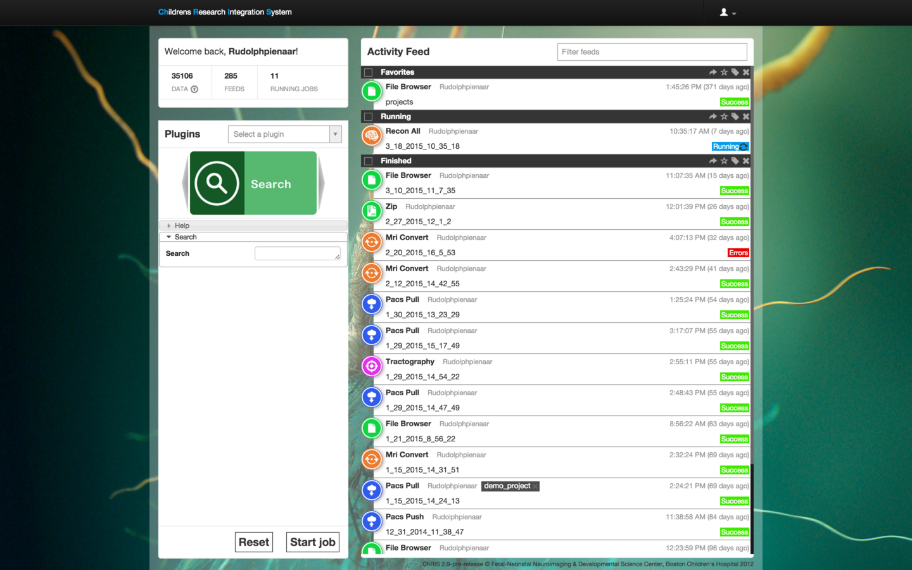
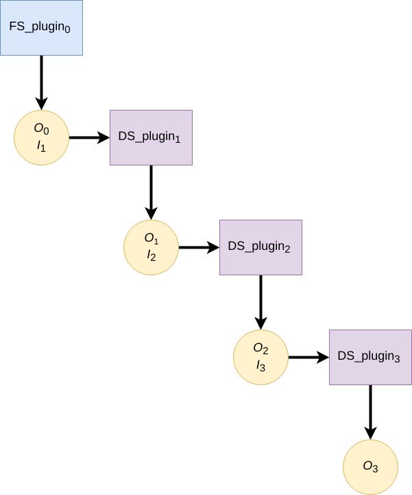

# A Forward Looking Retrospective: _ChRIS_ at the Crossroads -- Shortcomings of the 2016 Design

## Abstract

"ChRIS" is an umbrella term for a platform that provides various operations on (typically medical image) data. Several services and programs constitute ChRIS, of which the core component is called CUBE (the **C**hRIS **U**nderlying **B**ack-**E**nd). The existing ChRIS deployment that is _in production_ as of summer 2023 traces a direct lineage to a 2016 design (itself a re-imagining of an even older predecessor). While ChRIS is a _generally_ viable product, providing a largely feature complete user/client experience, the 2016 design is increasingly showing its age and no longer seems able to easily accommodate evolved requirements from 2023. Even seemingly simple and logical needs now require complex and un-intuitive workarounds, with technical debt accumulation only promising more debt and more workarounds.

The _ChRIS_ ecosystem offers industry-unique features and is serendipitously perfectly suited to be a powerful infrastructural component for AI (and other complex) compute workflows. Especially with regards to AI, _ChRIS_ offers a platform whereon a data scientist can deploy her algorithms in _development_ on a local laptop and then test them _in production_ on a variety of cloud platforms _immediately_. This feature is not offered by any commercial product today and has the potential to dramatically reduce the deployment time-frames of AI models.

Given these still-unmatched features, user adoption is critical to assure _ChRIS_ growth and success. At the core of user adoption is user _experience_, which itself is a function of client APIs and libraries the platform provides. Unfortunately, the current design offers inconsistent features and functionalities at the core of the ChRIS data paradigm. Even worse, there seems little predictability from a client viewpoint why certain seemingly trivial needs are serviced in some parts of ChRIS, but not in others. From a _client_ perspective, ChRIS seems to provide or mimic a system where _files_ are **always** organized in _directories_. However, depending on where in ChRIS files seem to be located, different and inconsistent (or non-existent) _directory_ operations are available.

This document asserts that this is due to fundamental disconnect between how ChRIS tries to act and how CUBE actually works: ChRIS seeks to consistently model the data space as organized into _directories_ while CUBE works with _files_ and does not model _directories_ as organizational units at all. The implications of this disconnect, while seemingly trivial in 2016, in 2023 now mandate complex ad-hoc retrofits, have led to multiple different data APIs, and make certain user requirements difficult-to-impossible to service. In this document we will explore how design decisions that chose to not model _directories_ in CUBE have led to increasing technical debt and argue that a redesign is now required to simplify future operations and elegantly solve many current seemingly intractable problems.

## Introduction and Background

In order to better understand why _ChRIS_ is where it is today, it is useful to understand its history, particularly what it originally meant to solve. By focusing explicitly on one part of its predecessor's limitation (_compute  management_), the 2016 _ChRIS_ design lost focus on what was working accidentally very well: _data management_. Arguably this is forgivable since _ChRIS_'s predecessor didn't manage _data_ explicitly either -- rather it outsourced all this to the underlying OS, and thus unwittingly benefited from decades of engineering by using OS concepts of _directories_ as a file group construct.

### Relevant History

The current ChRIS did not spring into existence with no prior art. In reality, a predecessor called _ChRIS RELoaded_ formed the base on which the current thinking was scaffolded. _ChRIS RELoaded_ (or _ChRISrel_ in this document) was a platform that allowed users to run command line neuroimaging programs from a web-based interface. _ChRISrel_ had no database, and its interface, written in PHP, simply "sat above" the underlying OS in a manner akin to how the ancient Windows95 sat above DOS. _ChRISrel_ leveraged a complex library of shell-scripts from PhP to define its set of behaviors and including the use of passwordless `ssh` calls to a compute resource to effect analyses -- there was no concept of containerization at the time.

_ChRISrel_ was a first-order compute platform, meaning a user could choose _input_, run some analysis on the input, and create _output_. Since _ChRISrel_ was focused on managing the _running_ of applications, it made no attempt to concern itself with how the _data_ for those applications would be handled by itself; rather it outsourced data management to the operating system and simply used _directories_ as basic data grouping elements since those are OS filesystem based constructs. Its interface was mostly a thin layer above a complex set of shell scripts that used the underlying OS **directly**.

At the core of _ChRISrel_ was the concept of a _Feed_, inspired by social media at the time, and meant to model "tweets". Each _Feed_ would be the analog of a tweet -- a component that simply showed the output of some program's output. Similarly to how twitter at the time showed a historical list of "tweets", _ChRISrel_ showed a historical list of _Feeds_, each of which being **one** analysis. Given than _ChRISrel_ was in reality a thin web interface over a filesystem, the filesystem became the core organizational tool for data. All outputs of an analysis were directly written to the filesystem in a **directory** and this directory was simply "shown" in the UI as a web-navigable screen element from which a user could "browser" the data space of created files.

.The main interface of ChRISrel showing a list of 1st order Feeds

Importantly, _ChRISrel_ offered a web-based javascript component that allowed for _direct_ browsing of the underlying UNIX filesystem and users could "choose" arbitrary directories from this browser to serve as _inputs_ to a given Feed.

### The drawbacks of _ChRISrel_

Neuroimaging computational research can be described as _N_ -th order, simply taken to mean _multi-step_. A computational analysis or experiment comprises many parts, for example: converting data from one form to another, analyzing the conversion, processing the conversion results, etc.

_ChRISrel_ only provided a _1st_ order system -- it only managed the inputs and outputs of _one_ compute process explicitly. If a user wanted to workflow a process consisting of, for example: [_convert_, _analyze_, _filter_, _report_], the **user** would have to create manually each step as a new independent _Feed_ and in a completely atomic (i.e. untracked) fashion, manually set the **output** of one _Feed_ (i.e. a _directory_) as the **input** to new _Feed_. Since _Feeds_ were disconnected single components with no relation to each other, _ChRISrel_ had no implicit way to know that any one _Feed_ was part of a workflow.

Attempts to retrofit concepts of "workflows" by using web-UI based client facing constructs like "tags" (a user could "tag" all Feeds that comprise a logical unit/workflow as such and explicitly name them) proved unsuccessful. This seemed to require too much organizational effort on a user and users rarely, if ever, used tags.

_ChRISrel_ remained at its heart _1st_-order and users became used to using the underlying filesystem for more complex behaviors, in other words _ChRISrel_ was insufficient in and of itself to service all user needs.

### What ChRIS (next generation) was fundamentally meant to solve

A _Feed_, or a first order unit of [ _input-directory_ &rarr; **_analysis_** &rarr; _output-directory_ ] was the core organizing unit of _ChRISrel_.

[.text-center]
.A 1st order Feed -- the IO is considered to be directories.

The user interface essentially was a table of a set of the above constructs, where the Feeds were labeled with the name of the compute, and a user was presented with a "drop in" file browser in the Feed to view the input and output directories.

Fundamentally, its successor, _ChRIS Next Generation_ or hereafter _ChRISnx_ was created to be _N_-th order, i.e. [ _input-directory_ &rarr; **_analysis_** &rarr; _data-directory_ &rarr; **_analysis_** &rarr; ... &rarr; _output-directory_ ]. This compute "tree" could branch. While the initial design spec did not allow for branches to rejoin, this is now a feature of the current system through special operations called _topological joins_.

.A linear non-branching N-th order Feed -- circles denote directories and blocks denote plugins

Having a _Feed_ be a collective structure that managed many compute elements where the input to one compute follows from the output of a predecessor compute was a powerful extension, one that also allowed the computational workflow to also be modeled as a graph structure called a _Directed Acyclic Graph_. Indeed this new _Feed_ concept and its representation became the **central** showpiece of _ChRISnx_.

Moreover, as the new design began to take shape, a "compute first" label was associated with this new _ChRISnx_ -- taken to mean its focus was on _computing_, and specifically _multi-step_ computing. The _platform_ would now implicitly handle the underlying plumbing allowing multiple **_compute-analysis_** blocks to be associated with one _Feed_. In fact, to reinforce this ability to "plug" many **_compute-analysis_** compute parts into one _Feed_, it was decided to even call these compute parts **plugins** (and not simply **apps**) to reinforce this association.

Continuing in this vein, considerable thinking was devoted to how to entice developers to this new **plugin** idea and to simplify as far as possible the steps needed to develop new **plugins** for _ChRIS_.

### Formalization of the ChRIS-way

_ChRISnx_ began to bill itself as "(multi-) compute first". It mostly concerned itself with the loose specifications of its "compute elements", aka _plugins_, and how to manage the compute flowing between them. These _plugins_ were to be (and still _are_) essentially command line applications of any type with almost no restrictions on argument space, with one core exception: every ChRIS plugin must honor two positional arguments, corresponding to _input-directory_ and _output-directory_. Given this (minor) restriction, it was anticipated that almost any command line.

While the reasons and details of plugins are less relevant, what is important is that plugins would **explicitly** consume as _data_ IO abstraction **directories** not files. Logically also any system that managed _ChRISnx_ compute should maintain that abstraction.

### What was lost and what was gained

At the time of the 2016 redesign, several new technologies were incorporated into _ChRISnx_ that would well position it for growth: applications were to be packaged into _containers_; the backend, called _CUBE_ became ascendant, a distributed microservice architecture began to be implemented for managing remote computation; and perhaps most tellingly for this discussion, a "cloud based" object storage technology, `swift`, was to be used for all CUBE data and **not** a simple Linux filesystem. This represented a considerable jump in both design, philosophy, and implementation for the _ChRIS_ system -- and _ChRISnx_ would become orders more powerful than _ChRISrel_.

_ChRISnx_ was to provide an _N_-th order compute management platform built around _Feeds_. To quote somewhat tongue-in-cheek the movie "Aliens": "all other priorities rescinded".

Inadvertently, however, because of the specification to position _Feeds_ as the primary data organizational construct, and the decision to use `swift` object storage, the explicit modeling of _directories_ in CUBE was lost. After all, _ChRISrel_ didn't even use _directories_ except as a convenience from the OS.

### The long tail of object storage and the original focus on _Feeds_

_ChRISnx_ started life as a system that, like _ChRISrel_, only really knew about _Feeds_. As long as the organizational abstraction of _Feeds_ could be modeled and allow web-based exploration of this structure in what seemed to be _files_ within _directories_, the original specification of _ChRISnx_ was satisfied.

This began to immediately have implications. All files were stored in `swift` and tracked one-to-one as associated "file objects" in the CUBE database. In fact, in order to exist in CUBE, a file had to physically exist in `swift`. This would have massive downstream implications in terms of real-file duplication and data storage inefficiency.

As a "leftover" of the old _ChRISrel_, objects in `swift` were still explicitly named as if they were part of a directory tree, i.e. the _name_ of a `swift` file still retained UNIX-style directory separator characters, `/` -- i.e. `user/feeds/feed_1/data/medicalimage.dcm`, but in reality this implicit organization was meaningless in `swift` and largely ignored by CUBE (particularly in its early designs). In `swift` all files float about in a huge shallow sea with no subdirectories or organization, and the `/` in the object name is simply a character with no implicit meaning.

The _relation_ of one file to another became part of a derived new organizational paradigm based on modeling _Feeds_ as database abstractions.

_Feeds_ now contained compute elements, i.e. instances of **plugins** that were related to each other in ancestor-derived relationships. For a _Feed_, one could determine the list of contained _plugininstances_ and for each _plugininstance_ one could determine its _parent_ (subsequent extensions to this also associated _children_ to each _plugininstance_). Moreover, each _plugininstance_ had a list of _files_ associated with it. Thus, for a given _Feed_, one could reconstruct the tree relationship of _plugininstances_ (_plugininstances_ are simply instances of a given _plugin_, i.e. _plugins_:_pluginstances_ as _class definitions_:_class instantiations_ in conventional programming). From these parent/child plugin relationships and given that each _plugininstance_ knows the files it created, it was possible to reconstruct a conventional filesystem hierarchy by mapping plugin descendants to next-level-down directories. In fact, CUBE did this as a once-off side-effect to know how to _name_ objects in `swift`. Although once named, CUBE ignored this other than to associate the file with its _plugininstance_.

### Shortcomings of the _Feed_ focused view -- the bootstrapping problem

Originally, like _ChRISrel_, all data would exist only in the _Feed_ model that tracked/managed computing elements called _plugins_. Logically thus, _plugins_ would be data- (aka file) _creators_ and _ChRISnx_ would be a universe of _Feeds_ of _plugins_ of _files_. A special class of plugin was conceived, called a _Feed-Synthesis_ or FS plugin that would exist only to "seed" or "synthesize" the root data for a new _Feed_.

It was originally imagined that FS plugins would be the only mechanism by which to "inject" new data into _ChRISnx_; however this proved in practice to be extremely cumbersome and inefficient. While it _could_ be possible, the amount of work required to satisfy such a simple and obvious requirement (i.e. create a new _Feed_ with some arbitrary user-chosen data by building a special FS plugin just with that data) seemed needlessly complex and unlikely to be popular with users.

### Ignoring the importance of anything outside a _Feed_

As a reluctant _exception_ to this model, the concept of user `uploads` was created. Users could select arbitrary files from their system, and "upload" to ChRIS/CUBE. They could "name" this upload set and the organization appearance of this upload would be a _directory_ existing in the user data sea and called by the specified "name" which contained the selected files.

This new set (or functional _directory_) could be used within CUBE to create the root of a new _Feed_. While this seemed to act like a conventional  _directories_ that contained _files_, many obvious directory type operations were not supported. This directory was effectively immutable: it could not be renamed, it could not have files added or deleted. Its entire purpose was merely to serve and exist "long enough" for a user to simply leverage this upload to create a new Feed.

It was thought that "uploads" would only ever be temporary things, existing _only_ as a convenience to inject new data into the system outside of the Feed/plugin model. While the space of uploads could persist in CUBE, it was not conceived that users would ever want more functionality than essentially an immutable directory space.

### Reinventing many wheels

At this stage, for a client to access information in a Feed, it needed to use a _Feed_-API. To access data that was "uploaded" it used the _uploads_-API. Ultimately both served to provide client the "illusion" of a _directory_ / _file_ universe view. Of course, the _directories_ in a Feed were different in unspecified ways to _directories_ in the "uploads".

Soon the need for yet-another-data-injection mechanism became apparent. The plugin model was not suited for interactive query of databases and so another _exception_ (or _extension_) to the _Feed_-primary data view was created -- the `SERVICES` model. While the scope is beyond this document, the primary service in this model relates to querying and collecting special medical image files called DICOMS from a Picture Archive and Communications System (PACS).

Files "pulled" from a PACS are stored in a different "directory" tree and require yet another specific API to access in order to browse.

### Inadvertently leveraging the accident of swift naming

Ultimately, within `swift` storage none of this complexity and context-specific behavior is apparent. Within `swift` storage, **all** files are named as if they were all part of one filesystem:

[source,console]
----
SERVICES/PACS/...
user1/uploads/dir/file1.dcm
user1/uploads/dir/file2.dcm
user1/feeds/feed_1/pl-dircopy/data/file1.dcm
user1/feeds/feed_1/pl-dircopy/data/file2.dcm
user1/feeds/feed_1/pl-dircopy/data/pl-dicom_headeredit/data/file1.dcm
user1/feeds/feed_1/pl-dircopy/data/pl-dicom_headeredit/data/file1.dcm

----

Ironically, if a client service were to access `swift` storage directly, it would have a unified view of the data space and able to access all the data using a single concept. Within CUBE, to collect files from the above, _three_ different APIs need to be accessed depending on where the files _happen_ to be located. There is no way for a client to ever intuit what API is needed for what set of filesystem space.

## Simple needs with cumbersome workarounds

At this juncture in 2023, several simple user needs are either not supported, or require complex, cumbersome and un-intuitive workarounds. Perhaps the most obviously neglected area is the user `uploads` space, which with only a slight re-imagination could be as powerful a differentiating characteristic of _ChRIS_ as its _N_-th order compute graphs managed on a growing set of cloud and compute backends.

### Organizing data

There is no reason _ChRIS_ could not be seen to be a data repository akin to services such as Google Drive. Of course, the idea is not to replicate or replace Google Drive, but merely to provide users the ability to just organize their own data! If presented with a familiar _directory_ / _file_ analog, users quite naturally want to use familiar file and directory operations. Users _should_ be able to organize files and directories to their preference within this space.

This includes such simple behaviours such as:

* renaming directories
* creating new directories
* adding more files to an existing directory and being able to create new nested subdirectories
* and of course, the inverse: deleting files and directories

Some of the above are being currently explored in a new front-end rewrite and only work within the `uploads` space/API.

### Sharing of data

A very obvious use case of _ChRIS_ is when a user uploads data to their `uploads` space and simply wants to "share" this data with another. At the moment, the only possible/supported mechanism is for the user to create new a 1st-order Feed, rooted off the uploaded data directory, and then _share_ that _Feed_ with the target user.

This is cumbersome, complex, and unintuitive.

### Universal adding/deleting of data and other behaviours

_ChRISnx_ presents the "illusion" of _directories_ in the data space, but only supports some obvious operations in some places and not others. For instance, there is no way to "upload" new arbitrary data to the "directories" of a _Feed_, nor is there anyway to delete any data produced by a plugin instance within a _Feed_.

### Duplication of data

_ChRIS_ has been shown to operate as a data "COUNT" (Create _Once_ Use _N_-Times) system, by which is meant that a single piece of data (say a file) is often used in a potential multiplicity of times in many places.

Moreover, _ChRISnx_ provides an extremely shallow reflection of `swift` storage -- by which is meant that internal CUBE file objects are one-to-one reflective of an object in `swift`.

Unfortunately, by requiring a one-to-one relationship between file objects in `swift` storage and their location in _ChRIS_ data space, and since `swift` does not support the concept of linking (either hard or soft), nor the concept of directories, any data in _ChRIS_ **must** be duplicated in its entirety to be used or seen by the system. For instance, uploading a set of say _N_ images, and then creating _M_ analyses or Feeds, necessitates copying the _N_ images _M_ times, resulting in (_N_ + 1)_M_ **identical** copies of the original data.

This is currently one of the core data-storage/usage inefficiencies in the _ChRISnx_ design.

### Transmission and reception of data -- the remote IO bottleneck

_ChRISnx_ provides an industry unique and powerful proposition: use the same platform and plugins and compute flows on almost _any_ remote compute environment: local machine, High Performance Computing Cluster, kubernetes cluster, and Openshift. In fact a core value proposition of _ChRIS_ is that users can deploy their plugins during development on the same platform as production.

_ChRIS_ microservices in the compute environment are responsible for running the actual plugins and managing data ingress and egress from _ChRIS_ to the remote environment.

At the moment, _ChRIS_ creates a local zip archive of all the files a remote compute instance might require (i.e. all the files in the designated input directory) and sends this to the remote microservice. In turn, the remote service unzips the transmission and presents the directory/files to the plugin. Finally, when completed, the remote service zips up the results and _ChRIS_ then pulls the zip, whereupon it unpacks the zip and registers any created files.

Consider now the case where the required operation in the remote compute is itself the actual creation of a zip archive of input data. This could be useful is a user wants to zip a directory to download to her local computer. The steps are:

* gather the files to process
* zip the files into an archive
* transmit the archive to the remote
* in the remote, unzip the archive
* present the files to a zip operation to create the archive the user wants
* on completion, zip up this resultant zip
* pull the zip back to _ChRIS_
* unzip the transmission to unpack the single zip file created in the remote
* register the zip file internally so it can be downloaded

In this rather contrived case we see that we effectively created and deconstructed and created and deconstructed our desired result _three_ times!

