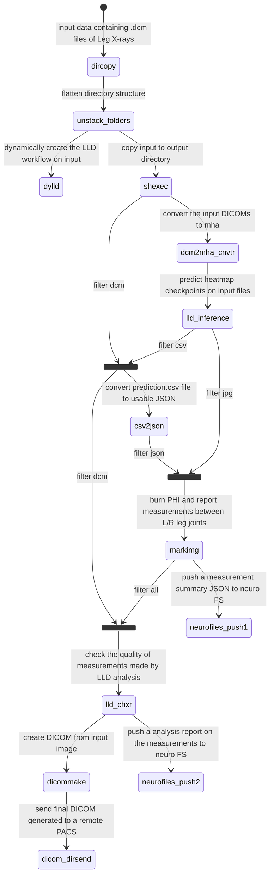

# LLD Analysis Workflow in ChRIS
The Leg Length Discrepancy (LLD) analysis is one of the most frequently used workflows in ChRIS. This process transforms leg X-rays from DICOM files into new DICOM files containing detailed measurements of the tibia and femur for both legs.

## Input and Output

- **Input**: Leg X-rays in DICOM format
- **Output**: New DICOM file with measurements including:
    - Lengths of tibia and femur for both legs
    - Differences between left and right leg measurements
    - Units: Typically in centimeters, occasionally in pixels (when suitable scaling parameters are unavailable)

## Workflow Overview

This document explains how the input file undergoes multiple image and text processing stages through various applications or plugins to produce the final DICOM file. The workflow determines hip, knee, and ankle joint positions to calculate tibia and femur lengths.
### Key Steps:

1. **Joint Detection**:
   - Plugin: pl-lld_inference (ML-based)
   - Function: Determines (x,y) coordinates of hip, knee, and ankle joints

2. **Image Processing and Measurement**:
   - Plugin: pl-markimg
   - Functions:
       - Draws joint coordinates on the input image
       - Calculates individual leg segment lengths
       - Compares measurements between legs

3. **DICOM Conversion**:
   - Plugin: pl-dicommake
   - Function: Converts the processed image with added information into a DICOM file

### Additional Plugins

The workflow includes other plugins for data filtering, conversion, validation, and aggregation. These are detailed in subsequent sections of this document.

Note: While the process of importing the initial DICOM file into ChRIS is interesting, it falls outside the scope of this workflow description.

## Analysis tree

## List of plugins used
### 1) pl-dylld (https://github.com/FNNDSC/pl-dylld)

This plugin creates a dynamic LLD analysis in ChRIS on the input Leg X-Rays. It expects a DICOM file in it's input directory. 
It requires the following pipelines  to be registered to the CUBE instance on which the plugin runs:

  1. Leg Length Discrepency inference on DICOM inputs v20230324-1 using CPU
  2. PNG-to-DICOM and push to PACS v20230324
  3. Leg Length Discrepency measurements on image v20230324
  4. Leg Length Discrepency prediction formatter v20230324

pl-dylld uses topological joins to aggregate data and add these pipelines to the workflow dynamically. It's a blocking 
plugin, meaning it waits till the entire LLD workflow finishes running on CUBE.

### 2) pl-shexec (https://github.com/FNNDSC/pl-shexec)
This plugin simply copies the input file, conforming to the specified file filter, to it's output directory.

### 3) pl-dcm2mha_cnvtr (https://github.com/FNNDSC/pl-dcm2mha_cnvtr)
This plugin converts the incoming DICOMs to .mha format and rotates the image 90 degrees anticlockwise. 
The downstream ML plugin ``pl-lld_inference`` expects a .mha file as input with this particular orientation for predicting
landmark points on the leg image.

### 4) pl-csv2json (https://github.com/FNNDSC/pl-csv2json)
This plugin expects an input dicom file and a csv file containing anatomical landmark points and serialize these information
to an output JSON file. The JSON file contains PHI that were extracted from the input DICOM, and x-y coordinates about 
joints like hips, ankles, and knees that the plugin interprets from the input csv file.

### 5) pl-lld_inference (https://github.com/FNNDSC/pl-lld_inference)
This plugin is an ML application that takes in an input Leg image as a .mha file. The plugin predicts landmark points to 
represent various joints. These points(x-y coordinates) are recorded in a .csv file. The plugin also generates heatmap images
of the leg joints.

You can also find input images of the Leg as a jpg file in the plugin's output directory.

### 6) pl-topologicalcopy (https://github.com/FNNDSC/pl-topologicalcopy)
This plugin filters and aggregates data from multiple nodes in a CUBE analysis to an output directory. We use this plugin 
at various points in the LLD workflow to provide necessary data to downstream plugins for further processing.

### 7) pl-markimg (https://github.com/FNNDSC/pl-markimg)
This plugin uses the ``matplotlib`` library to measure and calculate leg lengths and draw joints on the input leg image.
It expects an input image as well as a JSON file containing information such as PHI and different joints in the leg such
as hips, knees, and ankles respectively. 

The plugin also burns these information on the image. Finally, before saving, the plugin autoscales and rotates the 
image 90 degrees clockwise using `pillow` to conform to the original input DICOM.

### 8) pl-dicommake (https://github.com/FNNDSC/pl-dicommake)
This plugin is responsible to "DICOMize" an input image, given another input DICOM that contains a list of suitable file meta.
The plugin replaces the existing _PixelData_ from the input DICOM with the input image. It then dynamically adjust certain 
tags such as _PhotometricInterpretation_ and other image related tags before assigning the DICOM with a new _SeriesInstanceUID_.

Finally, the plugin also accepts an option parameter to compress the output DICOM file using **JPEG2000** encoding.

### 9) pl-lld_chxr (https://github.com/FNNDSC/pl-lld_chxr)
This plugin offers Quality Assurance(QA) of the results generated by the LLD analysis. It ensures that the output data
generated conforms to certain required standards and the measurements of legs are within a specific limit. The plugin also
checks for missing DICOM tags and appropriate measurement units.

The goal of this plugin is to only allow "valid" output downstream to be sent to remote PACS. It generated a _status_ file
towards the end of its execution that offers valuable information regarding the quality of the output DICOM.

### 10) pl-neurofiles-push (available in rc-gitlab)
This plugin pushes analysis files (JSON) generated in the workflow to a directory located in `/neuro` tree. These files 
can offer important insights into the nature of input vs output data and to perform other helpful data analysis algorithms.

### 11) pl-dicom_dirsend (https://github.com/FNNDSC/pl-dicom_dirsend)
This plugin pushes DICOM files from an input directory to a remote PACS. After the LLD analysis is finished and an 
appropriate output DICOM image is generated, `pl-dicom_dirsend` sends this DICOM to **SYNAPSERESEARCH** using the 
``dcmsend`` application available in `dcmtk` library.