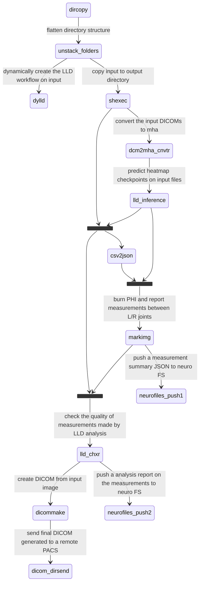

# LLD analysis of Leg Images
The LLD analysis is one of the most used workflows in ChRIS. The workflow starts with Leg X-rays as DICOM files and 
ends with a new DICOM generated, that has measurements of Tibia and Femur of both legs. Apart from their lengths, these
measurements also include differences between the left and right leg. The measurements are typically expressed in cm, 
however, sometimes(when a suitable scaling parameter is not present) these are also expressed in pixels.

While the explanation of how the input DICOM ended up in ChRIS is interesting in itself, it's beyond the scope of the
current topic. This document offers explanation of how the input file goes through multiple image and text processing 
applications or _plugins_ until we have a final DICOM that contains information about measurements and their discrepancy
in both the left and right leg. In order to calculate the length of tibia and femur of a leg, we need to determine its
hip, knee, and ankle joint first. We use an ML plugin, `pl-lld_inference`, to determine the (x,y) coordinates of these joints.
After that, we use an image processing plugin `pl-markimg` to use these coordinates to draw onto the input image, 
calculate the lengths of parts of individual legs, and provide a comparison between these calculations made. Finally,
we convert this image with additional information to a DICOM file using a plugin ``pl-dicommake``.

There are other plugins that offers filtering, converting, checking, and aggregating data within the workflow as well.
We explain them in subsequent sections below.

## Analysis tree

## List of plugins used
1) pl-dylld
2) pl-shexec
3) pl-dcm2mha
4) pl-csv2json
5) pl-lld_inference
6) pl-topologicalcopy
7) pl-markimg
8) pl-dicommake
9) pl-lld_chxr
10) pl-neurofiles-push
11) pl-dicom_dirsend