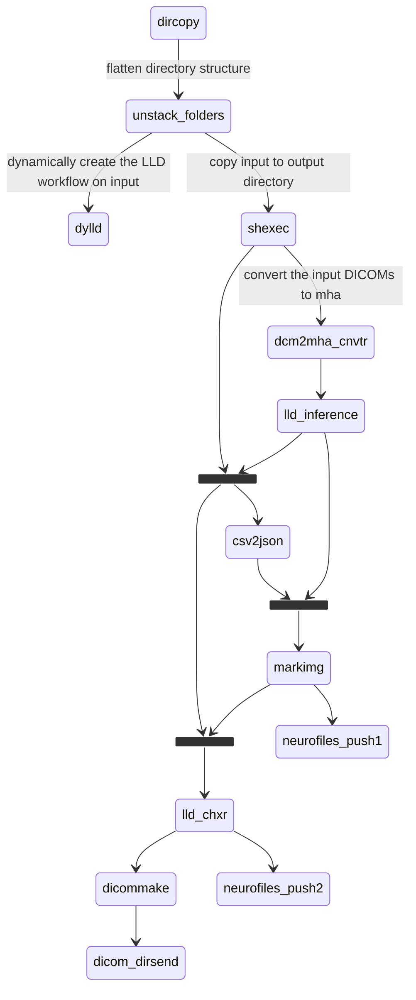

``LLD analysis of Leg Images``

``` List of plugins used```
1) pl-dylld
2) pl-shexec
3) pl-dcm2mha
4) pl-csv2json
5) pl-lld_inference
6) pl-topologicalcopy
7) pl-markimg
8) pl-dicommake
9) pl-lld_chxr
10) pl-neurofiles-push
11) pl-dicom_dirsend

```Analysis tree```

